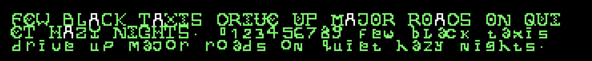
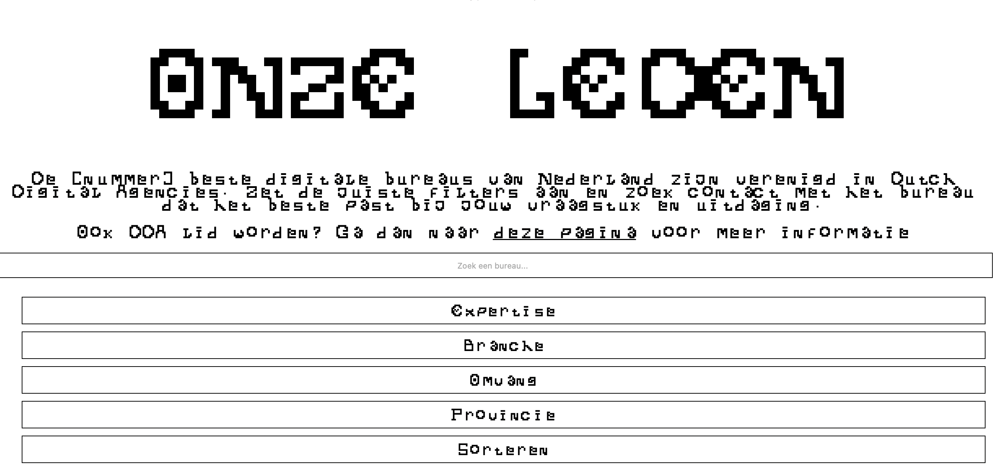

1 Minute Paper

Documenteren wat ik vandaag heb gedaan: 

Het maken van een eigen font en deze toegevoegd in mijn eigen design.

3 dingen die ik vandaag heb geleerd:

1. Het maken van een eigen font
2. Het maken van een OTF bestand
3. Het linken van een OTF bestand in mijn VSCode

Wat ga ik nu doen: 

Ik ga nu verder met mijn eigen opdracht en opnieuw mijn code schrijven ter voorbereiding op de sprint review van volgende week.