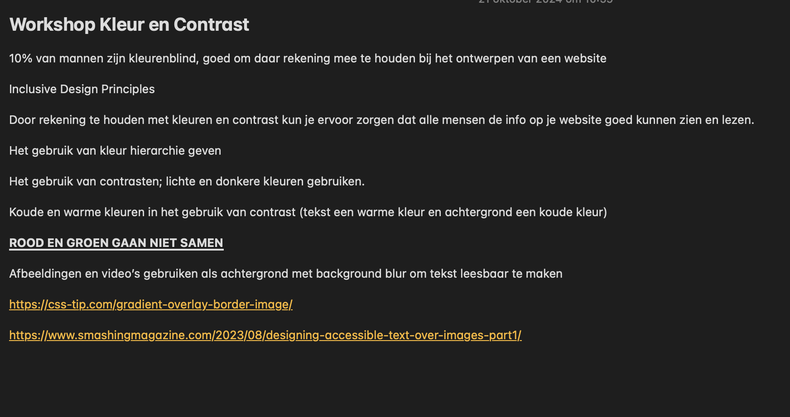

-Wat heb ik vandaag gedaan? 

Vandaag hebben we geleerd over het gebruiken van kleur contrasten op een website zodat iedereen een website kan gebruiken.

Dit zijn de aantekeningen die ik heb gemaakt:

Bronnen die ik heb gebruikt: 

https://css-tip.com/gradient-overlay-border-image/ 
https://www.smashingmagazine.com/2023/08/designing-accessible-text-over-images-part1/

Issues die ik heb ingeschoten: 

https://github.com/RenzoWille/all-human-accessible-website/issues/14 https://github.com/RenzoWille/all-human-accessible-website/issues/15 https://github.com/RenzoWille/all-human-accessible-website/issues/16 https://github.com/RenzoWille/all-human-accessible-website/issues/18

3 dingen die ik vandaag heb geleerd:

1. Het gebruiken van de W3C validator om de kleurcontrast te checken van een website
2. Hoe ik een blur op een achtergrond afbeelding kan zetten met CSS zodat de tekst er boven beter leesbaar is
3. Ik heb de Inclusive Design Principles leren kennen